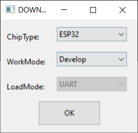
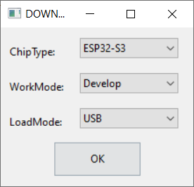
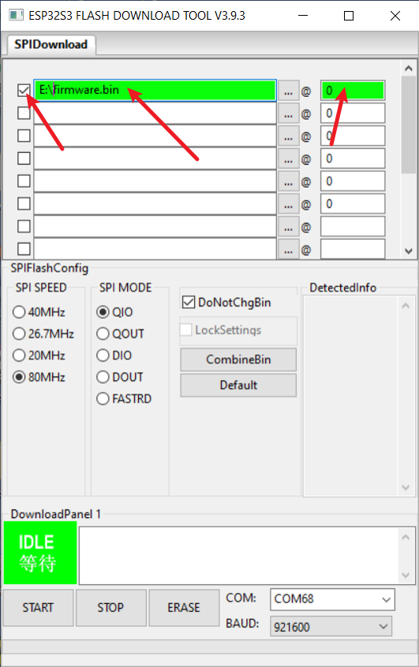

# Write to new users

- This page provides a quick diagnosis of whether the hardware is normal. The firmware in the example table below can provide a quick test of the hardware. Follow the writing method below.

# 1️⃣ Quickly diagnose hardware

| Product            | Test Firmware                                    |
| ------------------ | ------------------------------------------------ |
| [T-Journal][1]     | [firmware](./T-Journal-Firmware.bin)                                     |
| [T-Camera Plus][2] | [firmware](./t-camera-plus_factory_firmware.bin) |
| [T-SIMCAM][3]      | [firmware](./SIM-CAM-V1.3-FW.bin)                |

[1]: https://www.lilygo.cc/products/t-journal
[2]: https://www.lilygo.cc/products/t-camera-plus
[3]: https://www.lilygo.cc/products/t-simcam

## Use ESP Download Tool

| Steps  | [T-Journal][1]/[T-Camera-Plus][2] | [T-SIMCAM][3]                       |
| ------ | --------------------------------- | ----------------------------------- |
| Step 1 |    |  |
| Step 2 |    |  |

## Use Web Flasher

[esp.huhn.me](https://esp.huhn.me/)

# 2️⃣FAQ

- Can't upload any sketch，Please enter the upload mode manually.
   1. Connect the board via the USB cable
   2. Press and hold the BOOT button , While still pressing the BOOT button (If there is no BOOT button, you need to use wires to connect GND and IO0 together.)
   3. Press RST button
   4. Release the RST button
   5. Release the BOOT button (If there is no BOOT button, disconnect IO0 from GND.)
   6. Upload sketch

